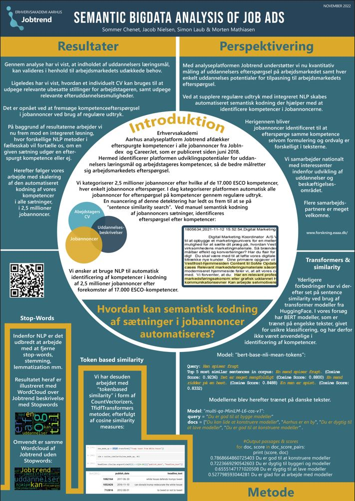

  

<h3>Prototype:</h3>
Code for the project prototype can be found <a href="Prototype/README.md">here</a>. 

<h3>Project Tutorials:</h3>
Can be found in this folder. 
(See the followting list of tutorial files for this <i>Semantic Similarity Search project</i>). 
 
-  <a href="IntroSpaCy.ipynb">IntroSpaCy.ipynb</a> 
(Short intro to the SpaCy library). 
 
- <a href="WordCloud.ipynb">WordCloud.ipynb</a> 
(How you can make your own WordClouds). 
 
- <a href="Newsgroup Categories.ipynb">Newsgroup Categories.ipynb</a> 
(Classification of (your) text into 4 newsgroups). 
 
- <a href="NLPJobClassifier.ipynb">NLPJobClassifier.ipynb</a> 
(Classification of jobs into groups "IT" or "non-IT"). 
Uses the datajobsposts.csv dataset 
(available elsewhere on Github/Kaggle). 
 
- <a href="BasicTextAnalytics.ipynb">BasicTextAnalytics.ipynb</a> 
(Misc. Techniques for basic text analytics). 
 
- <a href="SyntacticSimiliarity.ipynb">SyntacticSimiliarity.ipynb</a> 
(Code for syntactic similarity). 
Uses the abcnews-date-text.csv dataset 
(available elsewhere on Github/Kaggle). 
 
- <a href="SemanticRelationshipWordEmbedding.ipynb">SemanticRelationshipWordEmbedding.ipynb</a> 
(WordEmbeddings. Classic queen, king, man, woman example) 
 
-  
(Transformers and semantic similarity, english). 
 
-  
(Transformers and semantic similarity, danish). 
 
-  <a href="Wine_Classification.ipynb">Wine_Classification.ipynb</a>  
(A classic classification problem).  
Included here as part of a tutorial on ML techniques. 
 
- <a href="MyFirstQuad.ipynb">MyFirstQuad.ipynb</a> 
(A question answer transformer).  
Included here as part of a tutorial on ML techniques. 
 
 
Details: 
 
This folder contains a number of NLP files used in connection with the JobTrend Project (at Eaaa). 
 
In the program Jobtrend, we have a search function that looks for skills in JobAds
(Skills that a company hope an employee have). Available courses at Eaaa should then
be able to give employees these skills. 
 
Matching skills taught in courses and skills searched for in job ads is not trivial though.
As these skills might be described in a number of different ways. 
 
As a part of my investigation on how we should implement this semantic similarity search - a
number of techniques have been tried out. Where I have saved some of the files from this work
here in this folder. 
 
In case you wonder what a Wine.ipynb notebook is doing among these files, then, well, :) 
I needed to include a file with a classic classification problem 
in this folder in connection with a workshop/tutorial. And I have talked about the Titanic
problem too many times by now, and needed a similar, but different, case to talk about here.
The question answer transformer MyFirstQuad.ipynb is included as a simple example of this technique. 
 
More transformer based code will be added as the project JobTrend progresses. 
 
Simon Laub. 
Email: sila 
 
About JobTrend 
(In Danish): 
 
Med database og analyseværktøj tilbyder Jobtrend arbejdsmarkedsanalyser.  
Disse analyser skal afdække uddannelsers relevans i forhold til det 
danske arbejdsmarked og på den måde understøtte udviklingen af uddannelser. 
 
På sigt kan der omvendt opstå øget ledighed på det danske arbejdsmarked, 
og i den situation er det vigtigt at bibringe dimittender og ledige kompetencer, 
som gør den attraktive på det danske arbejdsmarked. I samfundet er der samlet set et vedvarende
behov for at uddanne arbejdsstyrken til de kompetencer, som er aktuelt nu og i fremtiden, der er behov for på arbejdsmarkedet.

